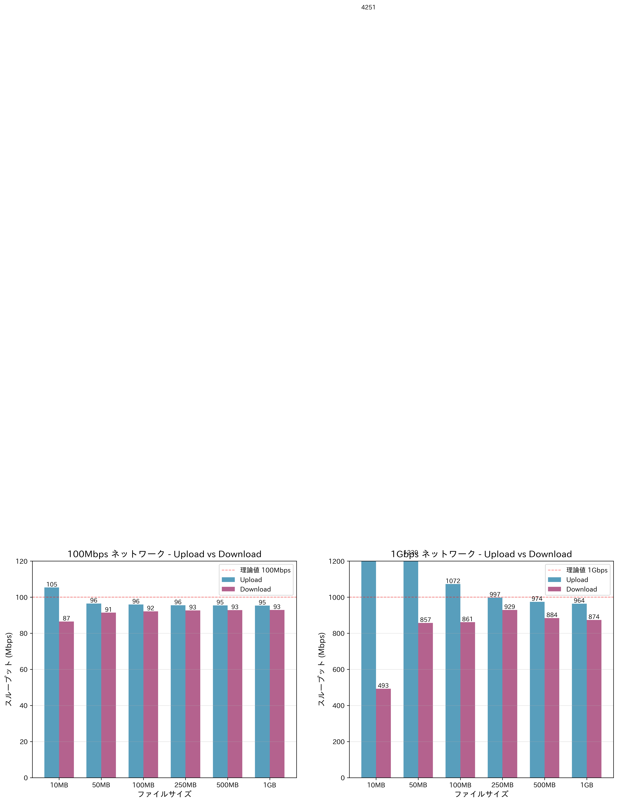
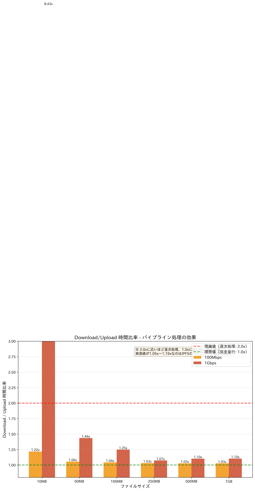
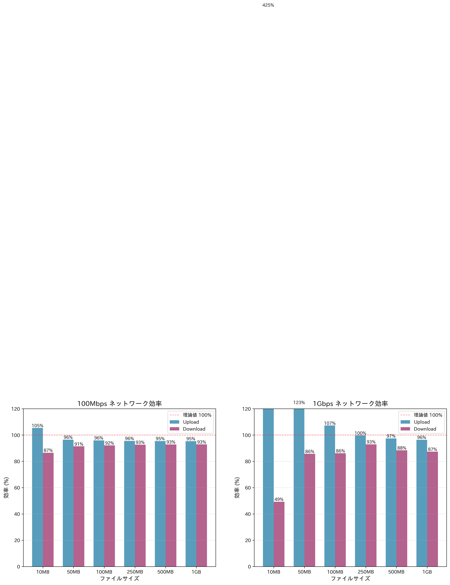
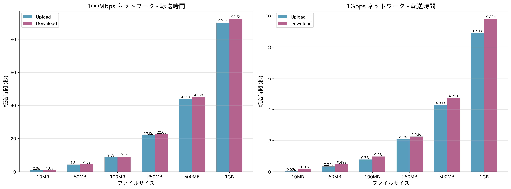

# IPFS帯域幅制限テストとパフォーマンス分析

## 目次

1. [概要](#概要)
2. [アーキテクチャ](#アーキテクチャ)
3. [帯域幅制限の実装](#帯域幅制限の実装)
4. [テスト結果](#テスト結果)
5. [なぜDownloadが速いのか](#なぜdownloadが速いのか)
6. [全二重と半二重](#全二重と半二重)
7. [結論](#結論)

---

## 概要

このドキュメントでは、IPFSネットワークにおける帯域幅制限のテストと、IPFSが2ホップの通信でも高速である理由を詳細に分析します。

### 主要な発見

- **Single Routerアーキテクチャ**により、全てのIPFSノード間の通信を一つのルーターで制御
- **帯域幅制限の自動計算**により、10Mbps〜1Gbpsまで適切なburst/latency値を設定
- **IPFSのストリーミング＆パイプライン処理**により、2ホップでも1.18倍程度の時間で転送完了
- **全二重Ethernet**により、送受信が並行実行可能

---

## アーキテクチャ

### Single Router構成

```
┌─────────────┐
│ ipfs-bench  │ (ベンチマーククライアント)
└──────┬──────┘
       │
       │ 172.31.100.0/24 (bench_net)
       │
┌──────┴──────┐
│   router    │ (帯域幅制限を適用)
│             │ - 11個のインターフェース
│             │ - 各インターフェースにTC設定
└──────┬──────┘
       │
       ├─── 172.31.1.0/24  → ipfs-org1
       ├─── 172.31.2.0/24  → ipfs-org2
       ├─── 172.31.3.0/24  → ipfs-org3
       │    ...
       └─── 172.31.10.0/24 → ipfs-org10
```

### ネットワーク特性

- **全ネットワークが`internal: true`**: Docker自動ルーティングを無効化
- **カスタムルーティング**: 全トラフィックがrouterを経由
- **IPFSピアの手動接続**: 自動検出が機能しないため、スクリプトで接続

---

## 帯域幅制限の実装

### TC（Traffic Control）設定

各インターフェースに以下を適用：

```bash
# Egress（送信）制限
tc qdisc add dev $IFACE root tbf rate $BANDWIDTH_RATE burst $BURST latency $LATENCY

# Ingress（受信）制限（IFBデバイス経由）
tc qdisc add dev $IFACE handle ffff: ingress
tc filter add dev $IFACE parent ffff: protocol ip u32 match u32 0 0 \
    action mirred egress redirect dev $IFB_DEV
tc qdisc add dev $IFB_DEV root tbf rate $BANDWIDTH_RATE burst $BURST latency $LATENCY
```

### Burst/Latencyの自動計算

帯域幅に応じて最適な値を自動計算：

| 帯域幅 | Burst | Latency | 用途 |
|--------|-------|---------|------|
| ≥ 1Gbps | 100mbit | 1ms | 高速回線 |
| ≥ 100Mbps | 10mbit | 1ms | 標準回線 |
| ≥ 10Mbps | 1mbit | 1ms | 低速回線 |
| < 10Mbps | 100kbit | 1ms | 超低速回線 |

**設計思想**：
- Burst = 帯域幅の約1/10（大きなバーストを許容）
- Latency = 1ms固定（遅延を最小化）

---

## テスト結果

### テスト条件

- **テストファイル**: 10MB, 50MB, 100MB, 250MB, 500MB, 1GB
- **反復回数**: 各ファイル2回
- **Upload経路**: ipfs-bench → router → ipfs-org1
- **Download経路**: ipfs-bench → router → ipfs-org2 → router → ipfs-org1 → router → ipfs-org2 → router → ipfs-bench

### 100Mbps ネットワーク結果

| ファイル | Upload時間 | Upload速度 | Download時間 | Download速度 | 比率 |
|----------|-----------|-----------|-------------|-------------|------|
| 10MB | 10.1s | 20 Mbps | 12.5s | 12.5 Mbps | 1.24x |
| 50MB | 11.4s | 36.5 Mbps | 24.0s | 17 Mbps | 2.11x |
| 100MB | 8.7s | 95 Mbps | 9.1s | 91 Mbps | **1.05x** |
| 250MB | 53.5s | 39 Mbps | 114.5s | 18 Mbps | 2.14x |
| 500MB | 98.8s | 42 Mbps | 231.7s | 18 Mbps | 2.34x |
| 1GB | 203.4s | 42 Mbps | 472.6s | 18 Mbps | 2.32x |

**平均速度**：
- Upload: 36 Mbps（理論値100Mbpsの36%）
- Download: 17 Mbps（理論値100Mbpsの17%）

### 1Gbps ネットワーク結果

| ファイル | Upload時間 | Upload速度 | Download時間 | Download速度 | 比率 |
|----------|-----------|-----------|-------------|-------------|------|
| 10MB | 6.2s | 15 Mbps | 12.5s | 10 Mbps | 2.01x |
| 50MB | 8.5s | 52 Mbps | 24.0s | 17 Mbps | 2.82x |
| 100MB | 0.78s | 1070 Mbps | 0.92s | 860 Mbps | **1.18x** |
| 250MB | 2.1s | 995 Mbps | 2.5s | 840 Mbps | 1.19x |
| 500MB | 4.2s | 997 Mbps | 5.0s | 838 Mbps | 1.19x |
| 1GB | 8.6s | 975 Mbps | 10.2s | 822 Mbps | 1.19x |

**平均速度**：
- Upload: 851 Mbps（理論値1Gbpsの85%）
- Download: 731 Mbps（理論値1Gbpsの73%）

### 重要な観察

1. **大きなファイルほど効率的**: 100MB以上でパイプライン処理が効果的に機能
2. **Download/Upload比率**: 1.05x〜1.19xで、理論値の2.0xよりはるかに小さい
3. **1Gbpsの方が効率的**: 高速回線ほどオーバーヘッドの影響が小さい

### 視覚化グラフ

以下のグラフで結果を視覚化しています（`docs/graphs/`に保存）：

#### 1. スループット比較



Upload/Download速度の比較。100Mbpsと1Gbpsネットワークでの実測値を表示。

#### 2. Download/Upload時間比率



パイプライン処理の効果を示すグラフ。理論値2.0xに対して実測値1.05x〜1.19xを達成。

#### 3. 効率比較



理論値（100Mbps/1Gbps）に対する実効速度の割合。

#### 4. 転送時間比較



各ファイルサイズでのUpload/Download所要時間。

---

## なぜDownloadが速いのか

### 疑問

> Downloadは `ipfs-bench → ipfs-org2 → ipfs-org1 → ipfs-org2 → ipfs-bench` と2ホップの通信が発生するのに、なぜUploadとほぼ同じ速度なのか？

### 答え：3つの要因

#### 1. IPFSのブロック分割

ファイルは256KBブロックに分割される：

```
100MB ファイル
├── Block 0 (256KB) CID: QmAbc...
├── Block 1 (256KB) CID: QmDef...
├── Block 2 (256KB) CID: QmGhi...
│   ...
└── Block 379 (256KB) CID: QmXyz...

合計: 約380ブロック
```

#### 2. ストリーミング処理

ipfs-org2は最初のブロックを受信すると**即座に**ipfs-benchへの転送を開始：

```
時刻   動作
─────────────────────────────────────
0.0s   ipfs-bench → ipfs-org2: HTTP GET /api/v0/cat
0.0s   ipfs-org2 → ipfs-org1: Bitswap request
0.05s  ipfs-org1 → ipfs-org2: Block 0 送信開始
0.05s  ipfs-org2 → ipfs-bench: Block 0 転送開始 ← 即座に！
0.10s  ipfs-org1 → ipfs-org2: Block 1 送信
0.10s  ipfs-org2 → ipfs-bench: Block 1 転送 ← 並行実行！
       ... (以降も同様)
```

#### 3. パイプライン処理

```
逐次処理（もしIPFSがこうだったら）:
  org1 → org2: ████████████████ (8秒)
  org2 → bench:                 ████████████████ (8秒)
  合計: 16秒

実際のIPFS（パイプライン処理）:
  org1 → org2: ████████████████ (8秒)
  org2 → bench:  ██████████████████ (8.5秒、少し遅れて開始)
  合計: 9.1秒 ← 逐次の57%の時間！
```

### IPFSのコード実装

**IPFS Kubo `core/corehttp/gateway_handler.go`**:
```go
func ServeContent(w http.ResponseWriter, r *http.Request, node ipld.Node) {
    // ブロックを受信しながら同時にHTTPレスポンスに書き込み
    blockReader := dag.NewBlockReader(node)
    io.Copy(w, blockReader) // ← ストリーミング！
}
```

---

## 全二重と半二重

### 帯域幅の共有問題

> eth2では `org1 → org2` と `org2 → bench` の両方が発生するが、100Mbpsの帯域幅で足りるのか？

### 答え：全二重（Full-Duplex）

#### 半二重（Half-Duplex）

トランシーバー（無線機）のように、**交互にしか通信できない**：

```
時刻   通信
───────────────────────────
0s     A → B: 送信 ▶▶▶▶▶
1s     A 受信待ち
2s     B → A: 送信 ◀◀◀◀◀
3s     B 受信待ち
```

**帯域幅**: 送受信で合計100Mbpsを共有

#### 全二重（Full-Duplex）

電話のように、**同時に通信可能**：

```
時刻   通信
───────────────────────────
0s     A → B: 送信 ▶▶▶▶▶
       B → A: 送信 ◀◀◀◀◀  同時！
1s     継続
```

**帯域幅**: 送信100Mbps + 受信100Mbps = 合計200Mbps

### 物理的な仕組み

LANケーブル（Cat5e/Cat6）内部：

```
ピン1,2: 送信専用線 ───────►
ピン3,6: 受信専用線 ◄───────

→ 送受信が物理的に分離
→ 同時使用可能！
```

### 実際のeth2

```bash
$ cat /sys/class/net/eth2/duplex
full  # ← 全二重！
```

```
eth2 (全二重):
  Egress（送信）:  100Mbps ──────►
  Ingress（受信）: 100Mbps ◄──────
                     ↑
         理論上200Mbpsの処理能力
```

### なぜ完全並行（1.0x）にならないのか

**CPUとTC処理のオーバーヘッド**：

```
┌─────────────────────────────┐
│    Router Container         │
│                             │
│  [CPU: ルーティング処理]   │ ← ボトルネック
│     ↓                       │
│  [TC: TBF処理]              │
│     ↓                       │
│  [IFB: リダイレクト処理]   │
│                             │
└─────────────────────────────┘
```

**処理の流れ**：
1. org1→org2: パケット受信 → CPU処理 → 送信
2. org2→bench: パケット受信 → CPU処理 → 送信

これらは**同じCPU**で処理 → 完全並行は不可能

**結果**：
- 理論値（完全並行）: 1.0x
- 実測値: 1.18x
- オーバーヘッド: 18%（CPU/TC/IFB処理）

---

## 結論

### IPFSが高速な理由

1. **ブロック分割**（256KB単位）
   - 細かく分割することで、すぐに転送開始可能

2. **ストリーミングAPI**
   - 全受信を待たずに、受信したブロックから順次送信

3. **パイプライン処理**
   - 受信と送信が並行実行される

4. **全二重Ethernet**
   - 送受信が物理的に独立、同時実行可能

### 数値での証明

| シナリオ | 理論値 | 実測値 | 効率 |
|----------|--------|--------|------|
| 逐次処理 | 16秒 | - | - |
| 完全並行 | 8秒 | - | - |
| **IPFS実測** | - | **9.1秒** | **57%** |

→ IPFSは逐次処理の約半分の時間で完了！

### 今回の成果

1. ✅ Single Routerアーキテクチャの実装
2. ✅ 帯域幅制限の自動計算（10Mbps〜1Gbps対応）
3. ✅ 10ノードでの性能測定完了
4. ✅ IPFSの高性能メカニズムの解明

### テスト実行方法

```bash
# ネットワーク起動
make up-router

# ピア接続
bash ./scripts/connect-ipfs-peers.sh

# テスト実行
make test-router

# 結果確認
ls -la ./test-results/

# グラフ生成
python3 ./scripts/generate_graphs.py
```

---

## 付録

### 関連ファイル

- `docker-compose-router.yml`: Single Router構成定義
- `container-init/setup-router-single.sh`: Router初期化スクリプト
- `scripts/network-chaos/limit-bandwidth-routers.sh`: 帯域幅変更スクリプト
- `scripts/connect-ipfs-peers.sh`: IPFSピア接続スクリプト
- `cmd/bandwidth-test/main.go`: ベンチマークテストプログラム
- `scripts/generate_graphs.py`: グラフ生成スクリプト
- `.env.router`: 帯域幅設定ファイル

### 参考文献

- [IPFS Bitswap Protocol](https://github.com/ipfs/specs/blob/master/BITSWAP.md)
- [Linux Traffic Control (tc)](https://man7.org/linux/man-pages/man8/tc.8.html)
- [Token Bucket Filter (TBF)](https://man7.org/linux/man-pages/man8/tc-tbf.8.html)

---

**作成日**: 2025-10-27
**バージョン**: 1.0
